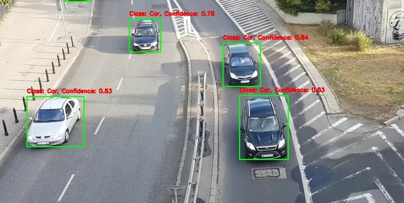
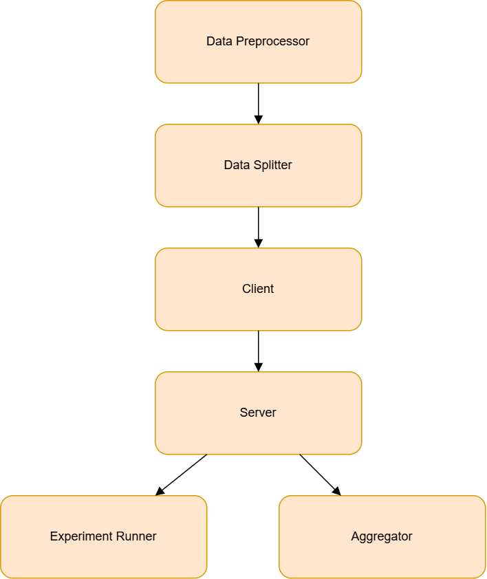
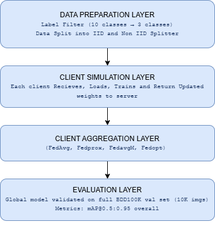
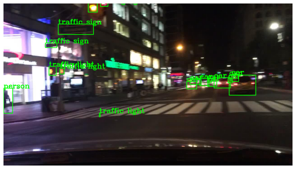
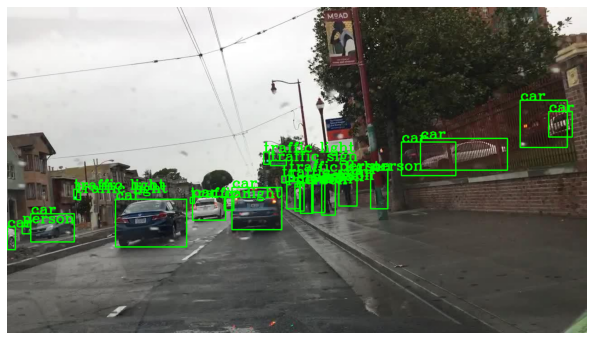
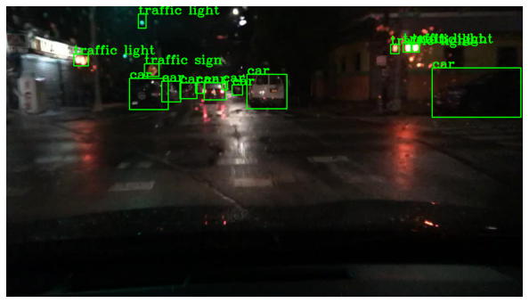
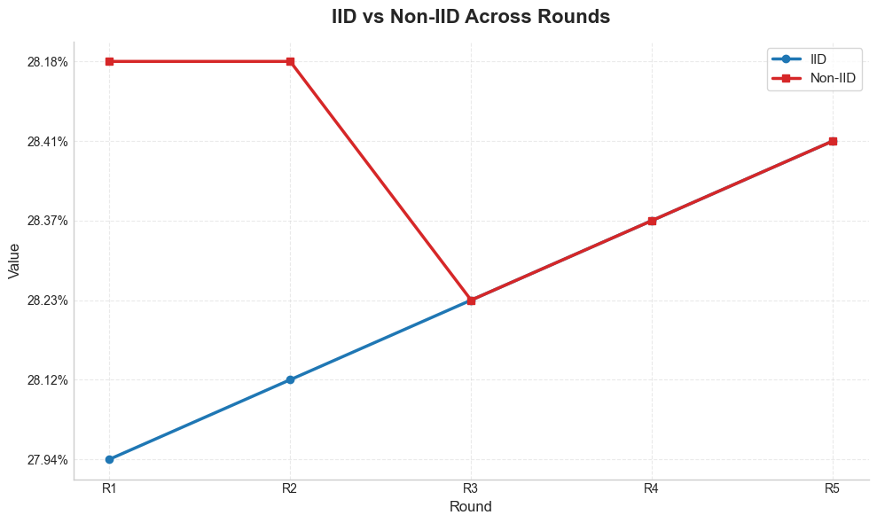
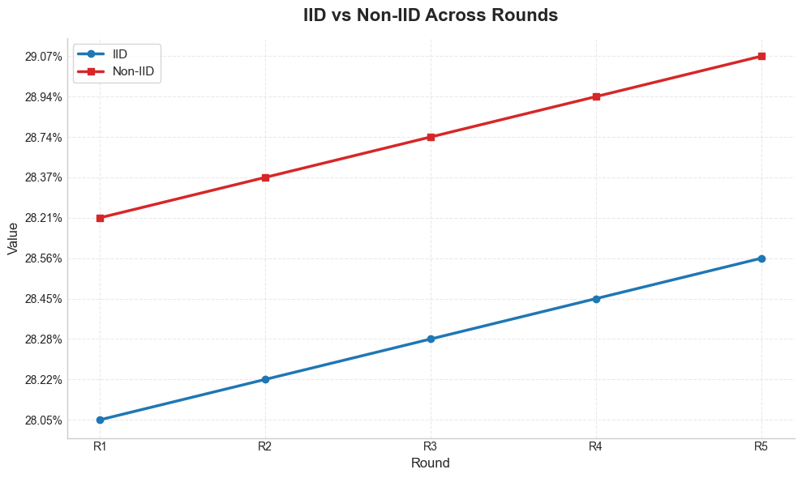
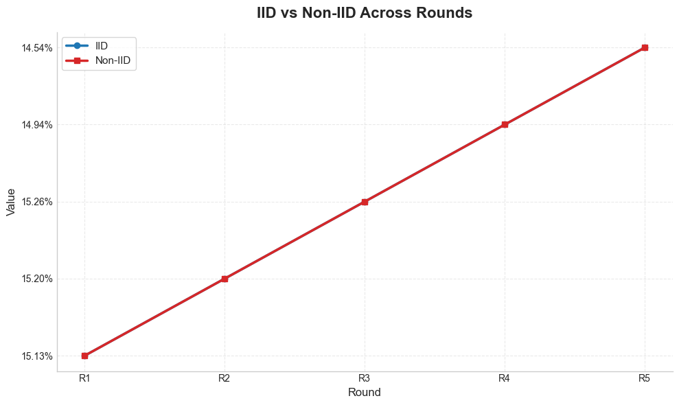
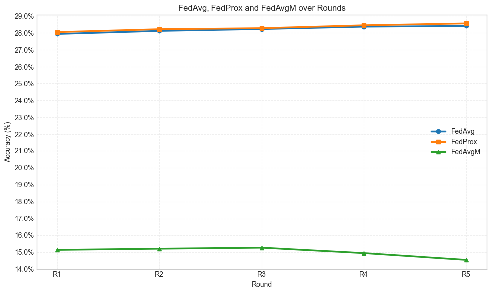

# 🚗 A Novel Method for Vehicle Detection in Smart Cities

### Privacy-Preserving Federated Object Detection using YOLOv8-Nano

*A Comparative Evaluation of FedAvg, FedProx and FedAvgM under IID and Non-IID Data Distributions*

> 📄 **Paper Status:** Under Review

---

---

# 📖 Abstract

This repository accompanies our research on **privacy-preserving vehicle detection for smart cities using Federated Learning**.

Conventional centralized object detection requires transmitting raw images from roadside cameras and connected vehicles to cloud servers, introducing privacy risks and communication overhead. To address these challenges, we investigate Federated Learning (FL), where edge devices collaboratively train a shared object detection model without exchanging raw data.

Our work presents a comparative evaluation of **FedAvg**, **FedProx**, and **FedAvgM** using **YOLOv8-Nano** on the **BDD100K** autonomous driving dataset under both **IID** and **Non-IID** data distributions.

Our experiments demonstrate that **FedProx achieves the highest detection accuracy**, while **YOLOv8-Nano reduces communication overhead by nearly 12× compared to YOLOv7**, making the framework practical for real-world smart city deployments.

---

# ✨ Highlights

- 🚗 Privacy-preserving vehicle detection using Federated Learning
- 🤖 YOLOv8-Nano based object detection
- 🌍 BDD100K dataset
- 👥 Five simulated federated clients
- 🔬 Comparison of FedAvg, FedProx and FedAvgM
- 📊 IID vs Non-IID analysis
- ⚡ 476 FPS inference
- 📡 12× lower communication cost than YOLOv7
- 💻 Runs on a single Tesla T4 GPU

---

# 📑 Table of Contents

- Overview
- Motivation
- System Architecture
- Dataset
- Experimental Setup
- Federated Learning Algorithms
- Repository Structure
- Results
- Comparison with FedPylot
- Key Findings
- Future Work
- Citation
- Authors

---

# 🌆 Motivation

Traditional centralized learning requires all cameras to upload raw driving images to a cloud server.

❌ Privacy Risk

❌ High Communication Cost

❌ Massive Storage Requirements

Federated Learning solves this by allowing every edge device to train locally and share only model parameters.

✔ Privacy Preserved

✔ Lower Bandwidth

✔ Edge Intelligence

---

# 🏗 System Architecture

The proposed framework consists of four major components:

1. **Data Preparation**
   - Dataset filtering
   - IID / Non-IID partitioning

2. **Client Simulation**
   - Local YOLOv8-Nano training
   - Local model optimization

3. **Federated Server**
   - Aggregates client models
   - Updates global model

4. **Evaluation**
   - Global validation
   - mAP computation
   - Performance comparison

---

# 🔄 Federated Learning Pipeline

Each communication round follows:

1. Server initializes the global YOLOv8 model.
2. Global model is sent to all clients.
3. Each client performs local training.
4. Clients send encrypted model updates.
5. Server aggregates updates.
6. Global model is updated.
7. Validation is performed.
8. Process repeats for multiple rounds.

---

# 📂 Dataset

## BDD100K

The BDD100K dataset was filtered into three classes for comparison with existing FL-based vehicle detection literature.

| Property | Value |
|------------|--------|
| Original Images | 100,000 |
| Training Images | 69,447 |
| Validation Images | 9,912 |
| Classes | Car, Person, Cyclist |
| Clients | 5 |

---

### Sample Images

---

# ⚙ Experimental Setup

| Parameter | Value |
|------------|---------|
| Detection Model | YOLOv8-Nano |
| Clients | 5 |
| Communication Rounds | 5 |
| Local Epochs | 3 |
| Batch Size | 16 |
| Image Resolution | 640×640 |
| GPU | Tesla T4 |
| Framework | PyTorch + Ultralytics |
| Evaluation Metric | mAP@0.5:0.95 |

---

# 🧠 Federated Learning Algorithms

| Algorithm | Description |
|------------|-------------|
| FedAvg | Standard weighted averaging of client models |
| FedProx | FedAvg with proximal regularization for heterogeneous data |
| FedAvgM | Server-side momentum based optimization |

---

# 📈 Experimental Results

## Overall Performance

| Algorithm | IID | Non-IID | FPS |
|------------|------|----------|------|
| FedAvg | 28.41 | 28.41 | 476 |
| FedProx | 28.56 | **29.07** | 476 |
| FedAvgM | 14.54 | 14.54 | 476 |

---

# 📊 Round-wise Performance

## FedAvg

---

## FedProx

---

## FedAvgM

---

# 📉 Combined Comparison

---

# 📡 Communication Cost

One of the key contributions of this work is reducing communication overhead.

| Model | Communication per Round |
|---------|------------------------|
| YOLOv7 | 74.8 MB |
| YOLOv8-Nano | **6.2 MB** |

---

# 📋 Comparison with FedPylot

| Feature | FedPylot | This Work |
|------------|------------|------------|
| Detection Model | YOLOv7 | YOLOv8-Nano |
| Dataset | KITTI / nuImages | BDD100K |
| Infrastructure | HPC Cluster | Single Tesla T4 |
| FedAvg | ✅ | ✅ |
| FedProx | ❌ | ✅ |
| FedAvgM | ✅ | ✅ |
| Communication | 74.8 MB | 6.2 MB |
| YOLOv8 | ❌ | ✅ |

---

# 🏆 Key Findings

- 🥇 **FedProx achieved the highest accuracy (29.07 mAP@0.5:0.95).**
- 🚀 **YOLOv8-Nano reduced communication overhead by 12×.**
- 🔒 **Raw images never leave client devices.**
- ⚡ **All successful models maintained real-time inference (~476 FPS).**
- 🌍 **BDD100K provides a more realistic evaluation than previous FL benchmarks.**

---

# 🔮 Future Work

- Secure Aggregation
- Differential Privacy
- Client Selection Strategies
- Adaptive Federated Optimization
- Cross-Silo Federated Learning
- Real Smart-City Deployment
- Edge TPU Optimization
- Transformer-based Object Detection

---

# 👨‍💻 Authors

| Name | Role |
|--------|------|
| Mohammed Sunain | Research, Federated Learning, Implementation |
| Challa Madhu Raghu Vamsi | Dataset & Experiments |
| Shaik Mohammad Razaa | Evaluation & Analysis |
| Rajesh S | Implementation & Validation |
| Mir Wajahat Hussain | Research Guide |

---

# 🙏 Acknowledgements

We sincerely thank:

- REVA University
- School of Computer Science and Engineering
- Kaggle for providing Tesla T4 GPU resources
- Ultralytics YOLO
- BDD100K Dataset
- The Federated Learning research community

---

### ⭐ If you find this work useful, please consider giving this repository a Star!

